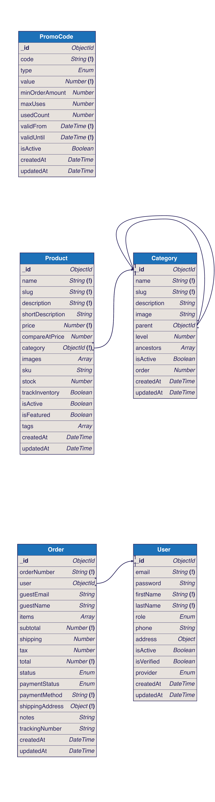

# IT 309 SOFTWARE ENGINEERING

# PROJECT DOCUMENTATION

## ShopKit - E-commerce SaaS Platform

**Prepared by:**
Student 1
Student 2

**Proposed to:**
Nermina Durmić, Assist. Prof. Dr.
Ajla Korman, Teaching Assistant
Amila Čaušević, Teaching Assistant

**Date of submission:** May 5, 2026

**GitHub Repository:** https://github.com/kerimredzepagic-sudo/ecommerce-platform

**Live Deployment:**
- Storefront (frontend): https://maksuz-web-b9f8eac5e948.herokuapp.com/
- API (backend): https://maksuz-server-68bc30ba8ab2.herokuapp.com/

**Demo Login Credentials (Admin panel):**
- URL: https://maksuz-web-b9f8eac5e948.herokuapp.com/login
- Email: `kerimredzepagic96@gmail.com`
- Password: `Admin123!`

After logging in, the admin dashboard is available at `/admin`.

---

## TABLE OF CONTENTS

1. Introduction
   1.1 About the Project
   1.2 High-Level Plan
   1.3 Project Requirements
   1.4 UML Diagrams
2. Project Structure
   2.1 Technologies
   2.2 Database Entities
   2.3 Architectural Pattern
   2.4 Design Patterns
   2.5 Project Functionalities and Screenshots
   2.6 Tests
   2.7 Coding Standards
   2.8 Deployment
3. Conclusion
4. Individual Contributions

---

## 1. Introduction

### 1.1 About the Project

ShopKit is a modern e-commerce SaaS (Software as a Service) platform designed for small and medium businesses in Bosnia and Herzegovina. The platform enables business owners to launch professional online stores without technical knowledge, at a price significantly lower than international alternatives like Shopify.

**Purpose:** To provide an affordable, locally-tailored e-commerce solution with support for local payment methods (cash on delivery, Monri), pricing in KM (Convertible Marks), and Bosnian language interface.

**Main Features:**
- Product catalog management with categories, variants, and inventory tracking
- Shopping cart and checkout (guest + registered users)
- Order management with status tracking
- Admin dashboard with sales analytics
- User authentication (email/password + Google OAuth)
- Responsive design (mobile-first approach)
- Promo code system with percentage, fixed, and free shipping discounts

**Benefits:**
- No technical knowledge required to manage a store
- Local payment methods and currency (KM)
- Zero transaction fees (unlike Shopify's commission model)
- Professional storefront with modern UI
- Dedicated instance per client for data isolation

**Competition:** Shopify (expensive, USD pricing, no local payments), WooCommerce (requires technical knowledge), Instagram DM selling (no system, unprofessional).

**Methodology:** Agile development with 2 releases aligned to university milestone deadlines.

---

### 1.2 High-Level Plan

We chose **Agile development** for this project. Below is our Product Roadmap and Release Plan.

#### Product Roadmap

| Release | Theme | Timeline | Key Deliverables |
|---------|-------|----------|------------------|
| Release 1 (v1.0) | Core Backend + Basic Storefront | Weeks 1-6 (Sprint 1-3) | Product/Category/Order CRUD, User authentication, Basic shop frontend, Admin product management |
| Release 2 (v2.0) | Full Application + Admin Panel + Deployment | Weeks 7-12 (Sprint 4-6) | Complete admin panel, Checkout flow with promo codes, Order tracking, Responsive UI, Tests, Public deployment |

#### Release Plan

**Release 1 (Milestone 2 - May 5, 2026)**
- Sprint 1 (Weeks 1-2): Project setup, database schema design, User authentication (register, login, JWT tokens)
- Sprint 2 (Weeks 3-4): Product CRUD API, Category CRUD API, Admin product management
- Sprint 3 (Weeks 5-6): Order creation API, Basic storefront UI (product listing, detail page), Cart functionality

**Release 2 (Milestone 3 - June 7, 2026)**
- Sprint 4 (Weeks 7-8): Full admin dashboard, Order management UI, Sales analytics
- Sprint 5 (Weeks 9-10): Checkout flow, Promo codes, Order tracking, Email notifications
- Sprint 6 (Weeks 11-12): Design patterns implementation, Tests (5+ meaningful tests), Deployment, Final documentation

---

### 1.3 Project Requirements

#### Functional Requirements (25 User Stories)

**US-1: Browse Products**
- As a customer, I want to browse all products in the store so that I can find items I want to purchase.
- Acceptance Criteria: Products displayed in a responsive grid layout; pagination works correctly; product images, name, and price are visible.

**US-2: Filter by Category**
- As a customer, I want to filter products by category so that I can narrow down my search.
- Acceptance Criteria: Category filter shows all active categories; selecting a category shows only products in that category and its subcategories; filter can be cleared.

**US-3: Search Products**
- As a customer, I want to search products by name so that I can quickly find specific items.
- Acceptance Criteria: Search input returns matching products; partial name matches are supported; search results update within 500ms of typing.

**US-4: Sort Products**
- As a customer, I want to sort products by price, name, or date so that I can find what I need efficiently.
- Acceptance Criteria: Sort options include price (low-high, high-low), name (A-Z), and newest; sort is applied immediately.

**US-5: View Product Details**
- As a customer, I want to view detailed product information so that I can make an informed purchase decision.
- Acceptance Criteria: Detail page shows name, full description, multiple images (gallery), price, stock availability, and category.

**US-6: Add to Cart**
- As a customer, I want to add products to my shopping cart so that I can purchase multiple items at once.
- Acceptance Criteria: Cart icon shows item count; item appears in cart with correct price; quantity is adjustable; cart persists across page navigation.

**US-7: Remove from Cart**
- As a customer, I want to remove items from my cart so that I can change my purchase decisions.
- Acceptance Criteria: Remove button removes item immediately; cart total updates; empty cart shows appropriate message.

**US-8: Guest Checkout**
- As a customer, I want to checkout without creating an account so that I can make a quick purchase.
- Acceptance Criteria: No registration required; email and shipping address collected; order placed successfully; order number returned.

**US-9: Cash on Delivery**
- As a customer, I want to choose cash-on-delivery payment so that I can pay when I receive my items.
- Acceptance Criteria: Cash on delivery selectable as payment method; order confirmation shows COD as payment type.

**US-10: Track Order**
- As a customer, I want to track my order status using an order number so that I know when to expect delivery.
- Acceptance Criteria: Order number lookup returns status (pending/confirmed/shipped/delivered); no authentication required for tracking.

**US-11: Register Account**
- As a customer, I want to register an account so that I can track my order history and save my details.
- Acceptance Criteria: Registration with email/password; password minimum 6 characters; duplicate email rejected; verification email sent.

**US-12: Login**
- As a customer, I want to log in to my account so that I can access my order history and profile.
- Acceptance Criteria: Login with email/password; JWT tokens returned; incorrect credentials show error; unverified accounts blocked.

**US-13: View Order History**
- As a registered customer, I want to view my past orders so that I can check their status or reorder.
- Acceptance Criteria: Order history page shows all past orders with status, total, and date; pagination works.

**US-14: Add Product (Admin)**
- As an admin, I want to add new products so that I can expand the store catalog.
- Acceptance Criteria: Form with all required fields (name, description, price, category); validation prevents invalid data; product appears in store after creation.

**US-15: Edit Product (Admin)**
- As an admin, I want to edit existing products so that I can update prices, descriptions, and stock.
- Acceptance Criteria: All fields are editable; changes persist after save; slug updates if name changes.

**US-16: Delete Product (Admin)**
- As an admin, I want to delete products so that I can remove discontinued items from the store.
- Acceptance Criteria: Confirmation required before deletion; product removed from store and search results.

**US-17: Manage Categories (Admin)**
- As an admin, I want to create, edit, and delete product categories so that products are organized.
- Acceptance Criteria: Hierarchical categories (up to 3 levels); create/edit/delete operations work; categories with subcategories cannot be deleted.

**US-18: View All Orders (Admin)**
- As an admin, I want to view all orders with filters so that I can process them efficiently.
- Acceptance Criteria: Order list shows all orders; filter by status works; pagination works; most recent orders shown first.

**US-19: Update Order Status (Admin)**
- As an admin, I want to update order status so that customers know their order progress.
- Acceptance Criteria: Status dropdown with all valid statuses; status change persists; shipped/delivered orders cannot be cancelled.

**US-20: View Dashboard (Admin)**
- As an admin, I want to view a dashboard with sales statistics so that I can monitor business performance.
- Acceptance Criteria: Dashboard shows today's orders/revenue, monthly orders/revenue, all-time statistics, and orders by status.

**US-21: Upload Product Images (Admin)**
- As an admin, I want to upload multiple images per product so that products look professional.
- Acceptance Criteria: Multiple images uploadable; primary image selectable; image preview shown before save.

**US-22: Manage Featured Products (Admin)**
- As an admin, I want to mark products as featured so that I can promote specific items on the homepage.
- Acceptance Criteria: Toggle featured status on product; featured products appear in homepage section.

**US-23: Create Promo Codes (Admin)**
- As an admin, I want to create promo/discount codes so that I can offer promotions to customers.
- Acceptance Criteria: Create codes with type (percentage/fixed/free shipping), value, validity dates, and usage limits.

**US-24: Apply Promo Code (Customer)**
- As a customer, I want to apply a promo code at checkout so that I get a discount on my order.
- Acceptance Criteria: Input field for code; invalid codes show error; valid codes show discount amount; total recalculated.

**US-25: Manage Store Profile (Admin)**
- As an admin, I want to update my profile information so that my account details are current.
- Acceptance Criteria: Edit first name, last name, phone, address; changes persist after save.

#### Non-Functional Requirements (3 User Stories)

**US-26: Page Load Performance**
- As a user, I want pages to load within 2 seconds so that browsing is not frustrating.
- Acceptance Criteria: API responses return within 500ms for 95% of requests; frontend pages render within 2 seconds on 4G network.

**US-27: Responsive Design**
- As a user, I want the application to work on mobile, tablet, and desktop so that I can shop from any device.
- Acceptance Criteria: Layout adapts from 320px to 1920px width; no horizontal scrolling; touch-friendly buttons; readable text without zooming.

**US-28: Data Security**
- As a user, I want my personal data to be secure so that my information is protected from unauthorized access.
- Acceptance Criteria: Passwords hashed with bcrypt (12 salt rounds); JWT tokens expire (access: 1h, refresh: 7d); all API inputs validated with Zod; role-based access control enforced.

---

### 1.4 UML Diagrams

#### Activity Diagrams

**Activity Diagram 1: Customer Checkout Process**

```
[Start] --> (View Cart) --> <Cart Empty?> 
    --[Yes]--> (Show "Cart Empty" Message) --> [End]
    --[No]--> (Enter Shipping Info) --> (Select Payment Method)
    --> <Guest or Registered?>
        --[Guest]--> (Enter Email)
        --[Registered]--> (Use Account Email)
    --> (Review Order) --> (Submit Order)
    --> <Stock Available?>
        --[No]--> (Show Stock Error) --> (Return to Cart)
        --[Yes]--> (Calculate Totals) --> (Create Order)
    --> (Reduce Stock) --> (Show Order Confirmation) --> [End]
```

**Activity Diagram 2: Admin Add/Edit Product**

```
[Start] --> (Open Product Form) --> (Fill Required Fields: name, description, price, category)
--> (Upload Images - optional) --> <Validate Form>
    --[Invalid]--> (Show Validation Errors) --> (Fill Required Fields)
    --[Valid]--> (Generate Slug from Name) --> <Slug Exists?>
        --[Yes]--> (Append Timestamp to Slug)
        --[No]--> (Use Generated Slug)
    --> (Save to Database) --> (Show Success Message) --> (Redirect to Product List) --> [End]
```

**Activity Diagram 3: Order Status Management**

```
[Start] --> (Admin Views Order) --> (Select New Status)
--> <Current Status = Shipped or Delivered?>
    --[Yes]--> (Show "Cannot Change" Error) --> [End]
    --[No]--> (Update Status in DB)
    --> <Status = Cancelled?>
        --[Yes]--> (Restore Product Stock)
        --[No]--> (Continue)
    --> <Status = Paid?>
        --[Yes]--> (Auto-set Order Status to Confirmed)
        --[No]--> (Continue)
    --> (Return Updated Order) --> [End]
```

**Activity Diagram 4: Product Search and Filter**

```
[Start] --> (Customer Opens Products Page) --> (Load All Active Products)
--> <Apply Filters?>
    --[Category Selected]--> (Filter by Category + Subcategories)
    --[Search Entered]--> (Filter by Name Regex)
    --[Price Range Set]--> (Filter by Min/Max Price)
    --[In Stock Only]--> (Filter Stock > 0)
--> (Apply Sort: price/name/date) --> (Paginate Results)
--> (Display Product Grid) --> [End]
```

#### Sequence Diagrams

**Sequence Diagram 1: Place Order (with alt fragment)**

```
Customer -> Frontend: Click "Place Order"
Frontend -> Backend: POST /api/orders {items, shippingAddress, paymentMethod}
Backend -> Backend: Validate input (Zod)
Backend -> Database: Find products by IDs

alt [All products found and in stock]
    Backend -> Backend: Calculate subtotal, shipping, tax, total
    Backend -> Database: Create Order document
    Backend -> Database: Reduce product stock (for each item)
    Backend -> Frontend: 201 {orderNumber, total, status}
    Frontend -> Customer: Show order confirmation page
else [Product not found or out of stock]
    Backend -> Frontend: 400 {error: "Insufficient stock for product X"}
    Frontend -> Customer: Show error message
end
```

**Sequence Diagram 2: Admin Product CRUD (with opt fragment)**

```
Admin -> Frontend: Fill product form and submit
Frontend -> Backend: POST /api/products (with Bearer token)
Backend -> AuthMiddleware: Verify JWT token
AuthMiddleware -> AuthMiddleware: Check role = "admin"
AuthMiddleware -> Backend: Request authorized

Backend -> Backend: Validate body (Zod createProductSchema)
Backend -> Backend: Generate slug from name

opt [slug already exists in DB]
    Backend -> Backend: Append timestamp to make slug unique
end

Backend -> Database: Create product document
Database -> Backend: Return created product
Backend -> Backend: Transform to ProductDTO (view layer)
Backend -> Frontend: 201 {product DTO}
Frontend -> Admin: Show "Product created successfully"
```

**Sequence Diagram 3: Order Tracking (with alt fragment)**

```
Customer -> Frontend: Enter order number, click "Track"
Frontend -> Backend: GET /api/orders/track/{orderNumber}
Backend -> Database: findOne({orderNumber})

alt [order found]
    Database -> Backend: Return order document
    Backend -> Backend: Extract public fields only (no user data)
    Backend -> Frontend: 200 {orderNumber, status, items, total, createdAt}
    Frontend -> Customer: Display order status and details
else [order not found]
    Database -> Backend: Return null
    Backend -> Frontend: 404 {error: "Order not found"}
    Frontend -> Customer: Show "Order not found" message
end
```

**Sequence Diagram 4: Apply Promo Code at Checkout (with alt fragment)**

```
Customer -> Frontend: Enter promo code, click "Apply"
Frontend -> Backend: POST /api/orders {promoCode: "SAVE20", ...}
Backend -> Database: Find PromoCode({code: "SAVE20", isActive: true})

alt [code found and valid]
    Backend -> Backend: Check validFrom <= now <= validUntil
    Backend -> Backend: Check usedCount < maxUses
    Backend -> Backend: Check subtotal >= minOrderAmount
    
    alt [type = "percentage"]
        Backend -> Backend: discountAmount = subtotal * (value / 100)
    else [type = "fixed"]
        Backend -> Backend: discountAmount = min(value, subtotal)
    else [type = "free_shipping"]
        Backend -> Backend: shipping = 0
    end
    
    Backend -> Backend: Apply discount to order total
    Backend -> Database: Increment PromoCode.usedCount
    Backend -> Frontend: 201 {order with discount applied}
    Frontend -> Customer: Show discounted total
else [code invalid/expired/maxed]
    Backend -> Backend: Ignore promo code (no error, just not applied)
    Backend -> Frontend: 201 {order without discount}
    Frontend -> Customer: Show regular total
end
```

#### Class Diagram

```
+------------------+          +-------------------+
|      User        |          |     Category      |
+------------------+          +-------------------+
| - _id: ObjectId  |          | - _id: ObjectId   |
| - email: String  |          | - name: String    |
| - password: String|         | - slug: String    |
| - firstName: String|        | - description: String|
| - lastName: String|         | - image: String   |
| - role: Enum     |          | - level: Number   |
| - phone: String  |          | - order: Number   |
| - isActive: Bool |          | - isActive: Bool  |
| - isVerified: Bool|         +-------------------+
+------------------+          | + create()        |
| + register()     |          | + getAll()        |
| + login()        |          | + getTree()       |
| + getProfile()   |          | + update()        |
| + updateProfile()|          | + delete()        |
+------------------+          +-------------------+
        |                            |  ▲
        | places          contains   |  | parent of
        | 1..*              1..*     |  | 0..1 --- 0..*
        ▼                            ▼  |
+------------------+          +-------------------+
|      Order       |          |     Product       |
+------------------+          +-------------------+
| - _id: ObjectId  |          | - _id: ObjectId   |
| - orderNumber: String|      | - name: String    |
| - subtotal: Number|         | - slug: String    |
| - shipping: Number|         | - description: String|
| - tax: Number    |          | - price: Number   |
| - total: Number  |          | - stock: Number   |
| - status: Enum   |          | - isActive: Bool  |
| - paymentMethod: String|    | - isFeatured: Bool|
+------------------+          +-------------------+
| + create()       |          | + create()        |
| + updateStatus() |          | + getAll()        |
| + cancel()       |          | + update()        |
| + track()        |          | + delete()        |
+------------------+          +-------------------+
        ◆                            
        | includes (composition)     
        | 1 --- 1..*                 
        ▼                            
+------------------+          
|    OrderItem     |          
+------------------+          
| - product: Ref   |  ◇-------| appears in
| - name: String   |  0..*    | 1..*
| - price: Number  |          |
| - quantity: Number|         (aggregation with Product)
| - image: String  |          
+------------------+          

+------------------+
|    PromoCode     |
+------------------+
| - code: String   |
| - type: Enum     |
| - value: Number  |
| - validFrom: Date|
| - validUntil: Date|
| - isActive: Bool |
+------------------+
| + validate()     |
| + apply()        |
+------------------+
      0..1 |
           | applied to
           | 0..*
           ▼
       (Order)
```

**Relationships:**
- User **places** Order (1..* to 0..* — one user can have many orders)
- Category **contains** Product (1 to 0..* — one category has many products)
- Category **parent of** Category (0..1 to 0..* — self-referencing hierarchy)
- Order **includes** OrderItem (1 to 1..* — **composition** — OrderItems cannot exist without Order)
- Product **appears in** OrderItem (1..* to 0..* — **aggregation** — Product exists independently of OrderItem)
- PromoCode **applied to** Order (0..1 to 0..* — an order may optionally have a promo code)

---

## 2. Project Structure

### 2.1 Technologies

#### Backend
- **Runtime:** Node.js (v18+)
- **Language:** TypeScript 5.3 (strict mode)
- **Framework:** Express.js 4.18
- **Database:** MongoDB 7+ with Mongoose 8.0 ODM
- **Authentication:** JSON Web Tokens (jsonwebtoken 9.0) — access token (1h) + refresh token (7d)
- **Validation:** Zod 3.22 (runtime schema validation on all API inputs)
- **Password Hashing:** bcryptjs (12 salt rounds)
- **Security:** Helmet.js (HTTP security headers), CORS configuration

#### Frontend
- **Framework:** Next.js 15 (App Router with React Server Components)
- **Language:** TypeScript 5
- **UI Library:** React 19
- **Styling:** Tailwind CSS 3.4 with tailwindcss-animate
- **Component Library:** Shadcn/ui (Radix UI primitives)
- **Data Fetching:** TanStack React Query v5
- **Forms:** React Hook Form 7 + Zod validation
- **State Management:** React Context API (AuthContext, CartContext)
- **Notifications:** Sonner (toast notifications)

#### Database
- **Type:** MongoDB (NoSQL document database)
- **ODM:** Mongoose 8.0
- **Design:** Document-based with references between collections

#### Coding Standard

**Backend (TypeScript/Express):**
- TypeScript strict mode enabled
- ESLint with recommended rules
- camelCase for variables and functions
- PascalCase for interfaces, types, and classes
- kebab-case for file names (e.g., `auth.controller.ts`, `product.service.ts`)
- RESTful API naming conventions (`GET /api/products`, `POST /api/products`, `PUT /api/products/:id`)
- Consistent API response format: `{ success, data, message, error, meta }`

**Frontend (TypeScript/React):**
- TypeScript strict mode
- ESLint (Next.js config) + Prettier for formatting
- Functional components with hooks (no class components)
- React Hook Form + Zod for form validation
- Tailwind utility-first CSS (no custom CSS files)
- Path alias `@/` maps to `src/`

---

### 2.2 Database Entities

The application uses 5 main entities/collections:

1. **User** — Stores customer and admin accounts with authentication data (email, hashed password, JWT refresh token, role, verification status)

2. **Product** — E-commerce products with name, description, price, images, SKU, stock level, category reference, variants, and SEO metadata

3. **Category** — Hierarchical product categories (up to 3 levels deep) with self-referencing parent field and ancestors array for efficient querying

4. **Order** — Purchase records supporting both registered and guest customers, with embedded order items, shipping/billing addresses, status tracking, and optional promo code

5. **PromoCode** — Discount codes with type (percentage/fixed/free_shipping), validity dates, usage limits, and minimum order amount

#### ER Diagram



*Source: [`docs/ER-diagram.dbml`](./ER-diagram.dbml). Rendered to SVG with `@softwaretechnik/dbml-renderer` and to PNG with `@resvg/resvg-js`.*

**Relationships:**
- User 1 --- 0..* Order (one user places many orders; nullable for guest orders)
- Category 1 --- 0..* Product (one category contains many products)
- Category 0..1 --- 0..* Category (self-referencing parent-child hierarchy)
- Order contains embedded OrderItems which reference Products (many-to-many via embedding)
- PromoCode 0..1 --- 0..* Order (optional discount applied to orders)

---

### 2.3 Architectural Pattern

**MVCS (Model-View-Controller-Service)** — The backend uses a four-layer separation that keeps each concern isolated and individually testable:

| Layer | Responsibility | Location |
|---|---|---|
| **Model** | Mongoose schemas — data shape, validation, indexes, virtuals, lifecycle hooks. | [`maksuz-server/src/models/`](../maksuz-server/src/models/) |
| **View** | DTO transformation — convert Mongoose documents to stable, public-safe API contracts (hides internal `_id`, `password`, refresh tokens, etc.). | [`maksuz-server/src/views/`](../maksuz-server/src/views/) |
| **Controller** | HTTP layer — parse request, call services, format response. No business logic. | [`maksuz-server/src/controllers/`](../maksuz-server/src/controllers/) |
| **Service** | Business logic and orchestration across multiple models. | [`maksuz-server/src/services/`](../maksuz-server/src/services/) |

**Why MVCS over MVC:** with a plain MVC layout, business rules end up in controllers, which makes them hard to reuse and hard to test without spinning up Express. Pulling rules into a Service layer means a controller is a thin adapter (request in → service call → response out) and the same service can be reused from a CLI script (e.g. [`maksuz-server/src/scripts/seed.ts`](../maksuz-server/src/scripts/seed.ts)) or a test (see [`maksuz-server/tests/services/`](../maksuz-server/tests/services/)). The View layer was added so route handlers never have to remember which fields are safe to send back — e.g. [`toOrderDTO`](../maksuz-server/src/views/order.view.ts) strips `refreshToken` from the populated user, and [`getByOrderNumberPublic`](../maksuz-server/src/services/order.service.ts) (used by the public order-tracking endpoint) returns an even narrower projection.

**Concrete request flow — `POST /api/orders/guest`:**

```
HTTP request
  → guestOrderSchema.parse()                 (validators/order.validator.ts — Zod input contract)
  → orderController.createGuestOrder()       (controllers/order.controller.ts:104)
  → orderService.createGuestOrder()          (services/order.service.ts:134)
      ↳ Product.find / Product.findByIdAndUpdate   (models/Product.model.ts — Mongoose access)
      ↳ PromoCode.findOne / findOneAndUpdate       (models/PromoCode.model.ts)
      ↳ Order.create                                (models/Order.model.ts — pre-save hook generates orderNumber)
  → sendCreated(res, …)                       (utils/apiResponse.ts — unified envelope)
HTTP response
```

The frontend mirrors this with a feature-folder layout under [`maksuz-web/src/app/`](../maksuz-web/src/app/) (App Router pages), domain components in [`maksuz-web/src/components/{shop,admin,cart,…}`](../maksuz-web/src/components/), and a React-Query-based data layer in [`maksuz-web/src/hooks/use*Api.ts`](../maksuz-web/src/hooks/) — clear separation of pages, presentation, and data fetching.

---

### 2.4 Design Patterns

The codebase implements three design patterns that each solve a concrete problem (not just for show).

#### 1. Singleton — shared service instances

Each service is exported as a single shared instance rather than a class consumers re-instantiate per request:

- [`maksuz-server/src/services/product.service.ts:170`](../maksuz-server/src/services/product.service.ts) — `export const productService = new ProductService();`
- [`maksuz-server/src/services/order.service.ts:336`](../maksuz-server/src/services/order.service.ts) — `export const orderService = new OrderService();`
- [`maksuz-server/src/services/auth.service.ts:236`](../maksuz-server/src/services/auth.service.ts) — `export const authService = new AuthService();`
- [`maksuz-server/src/services/category.service.ts:150`](../maksuz-server/src/services/category.service.ts) — `export const categoryService = new CategoryService();`

**Why this pattern:** services are stateless coordinators on top of the Mongoose connection. Creating a new `OrderService` per HTTP request would cost nothing in memory but it would scatter the question "is this the *real* order service or a mock?" across the codebase. By exposing one canonical instance per module, every controller and every test imports the same object — and Node's ES-module cache makes that "Singleton" effectively free. The pattern also gives us a single seam to swap when wiring tests: a `jest.spyOn(orderService, 'create')` reliably intercepts every caller, including the route layer.

#### 2. Strategy — promo-code discount calculation

The promo-code system has three discount families (`percentage`, `fixed`, `free_shipping`) that each compute the order total differently. The Strategy pattern lives in [`OrderService.validateAndApplyPromoCode`](../maksuz-server/src/services/order.service.ts) ([`maksuz-server/src/services/order.service.ts:42-62`](../maksuz-server/src/services/order.service.ts#L42-L62)):

```ts
if (promoCode.type === "percentage") {
  discountAmount = subtotal * (promoCode.value / 100);
} else if (promoCode.type === "fixed") {
  discountAmount = Math.min(promoCode.value, subtotal);
}
// 'free_shipping' is handled by zeroing `shipping` later in createOrder
```

Followed by ([`maksuz-server/src/services/order.service.ts:99-100`](../maksuz-server/src/services/order.service.ts#L99-L100)):

```ts
let shipping = subtotal >= 50 ? 0 : 5;
if (appliedPromo?.type === "free_shipping") shipping = 0;
```

**Why this pattern:** the alternative — a single nested `if` chain inside `create` — would bake the discount math into the order-creation flow and make it hard to add a new discount type (e.g. "buy one get one free") without touching unrelated code. The current design isolates each discount calculation behind a `type` discriminator. Adding a new strategy means one new branch and one new case in the validator, with no edits to the order pipeline. The pattern is also exercised by tests in [`maksuz-server/tests/services/order.service.test.ts`](../maksuz-server/tests/services/order.service.test.ts) ("applies a percentage discount", "applies a free-shipping promo by zeroing the shipping cost", "ignores an expired promo code").

#### 3. Adapter (DTO) — view layer

Mongoose documents carry internal Mongo state (`_id`, `__v`, refresh tokens, password hashes, hydration helpers) that should never leak across the API boundary. The view layer adapts each model to a stable wire format:

- [`maksuz-server/src/views/product.view.ts:63`](../maksuz-server/src/views/product.view.ts#L63) — `toProductDTO` produces a `ProductDTO` with `id` (string), flattened `category`, derived `inStock` / `isOnSale` / `discount` fields, and `attributes` as a plain object (not a Mongoose `Map`).
- [`maksuz-server/src/views/product.view.ts:121`](../maksuz-server/src/views/product.view.ts#L121) — `toProductListDTO` returns a slimmer shape (no `description`, no `variants`) optimized for listing endpoints to keep payloads small.
- [`maksuz-server/src/views/order.view.ts:57`](../maksuz-server/src/views/order.view.ts#L57) — `toOrderDTO` adapts the populated user (drops `password`, `refreshToken`) and computes `itemCount`.
- [`maksuz-server/src/services/order.service.ts:317`](../maksuz-server/src/services/order.service.ts#L317) — `getByOrderNumberPublic` is an even narrower adapter used for the unauthenticated order-tracking page: it returns only the order number, status, items, totals, and the buyer's city/country — never the street, phone, or email.

**Why this pattern:** decoupling the wire format from the database schema means we can change Mongoose internals (e.g. switch `attributes` from `Map` to a sub-document) without breaking the frontend, and we can confidently expose `getByOrderNumberPublic` to anonymous traffic because the adapter shape is the security boundary, not the model.

---

### 2.5 Project Functionalities and Screenshots

#### Implemented features

**Customer storefront** ([`maksuz-web/src/app/shop/`](../maksuz-web/src/app/shop/))
- Product catalog with search, category filter, price range, in-stock toggle, sort (price/name/date) — [`shop/products/ShopProductsClient.tsx`](../maksuz-web/src/app/shop/products/ShopProductsClient.tsx)
- Product detail with image gallery, variants, stock indicator — [`shop/product/[id]/ProductPageClient.tsx`](../maksuz-web/src/app/shop/product/%5Bid%5D/ProductPageClient.tsx)
- Cart drawer with quantity adjustment and localStorage persistence — [`components/cart/CartDrawer.tsx`](../maksuz-web/src/components/cart/CartDrawer.tsx), state in [`contexts/CartContext.tsx`](../maksuz-web/src/contexts/CartContext.tsx)
- Checkout for registered + guest users — [`shop/checkout/CheckoutPageClient.tsx`](../maksuz-web/src/app/shop/checkout/CheckoutPageClient.tsx)
- Public order tracking by order number — [`shop/order/track/OrderTrackClient.tsx`](../maksuz-web/src/app/shop/order/track/OrderTrackClient.tsx)
- Order confirmation page — [`shop/order/confirmed/OrderConfirmedClient.tsx`](../maksuz-web/src/app/shop/order/confirmed/OrderConfirmedClient.tsx)

**Authentication** ([`maksuz-web/src/app/{login,register}/`](../maksuz-web/src/app/login/))
- Email/password register + verify, login with JWT (access + refresh), Google OAuth — [`services/auth.service.ts`](../maksuz-server/src/services/auth.service.ts)
- Auth context provides user state across the app — [`contexts/AuthContext.tsx`](../maksuz-web/src/contexts/AuthContext.tsx)

**Admin panel** ([`maksuz-web/src/app/admin/`](../maksuz-web/src/app/admin/))
- Dashboard with KPI cards (today / this month / all-time orders + revenue, by-status breakdown) — [`admin/page.tsx`](../maksuz-web/src/app/admin/page.tsx), [`components/admin/OrderKPICards.tsx`](../maksuz-web/src/components/admin/OrderKPICards.tsx)
- Product CRUD with image upload, variants, attributes, rich-text description — [`admin/products/`](../maksuz-web/src/app/admin/products/), [`components/admin/products/`](../maksuz-web/src/components/admin/products/)
- Category management with hierarchical tree (3 levels) — [`admin/categories/page.tsx`](../maksuz-web/src/app/admin/categories/page.tsx)
- Order management with status updates, cancellation, customer browser — [`admin/orders/`](../maksuz-web/src/app/admin/orders/)

#### Responsive design

The application is responsive from 320 px to 1920 px using Tailwind breakpoints (`sm:` 640, `md:` 768, `lg:` 1024, `xl:` 1280). Notable adaptations:

- Mobile-first nav with a collapsible drawer ([`components/shared/ShopNavbar.tsx`](../maksuz-web/src/components/shared/ShopNavbar.tsx))
- Filter sidebar collapses into a bottom-sheet drawer below `md` ([`components/shop/MobileFilterDrawer.tsx`](../maksuz-web/src/components/shop/MobileFilterDrawer.tsx))
- Product grid switches from 1 → 2 → 3 → 4 columns by breakpoint ([`components/shop/AnimatedProductGrid.tsx`](../maksuz-web/src/components/shop/AnimatedProductGrid.tsx))
- Admin sidebar collapses to icons-only on `md`, slides off-canvas on mobile ([`components/admin/AdminSidebar.tsx`](../maksuz-web/src/components/admin/AdminSidebar.tsx), [`hooks/use-mobile.tsx`](../maksuz-web/src/hooks/use-mobile.tsx))

#### Screenshots

Screenshots of the main screens are collected in [`docs/screenshots/`](./screenshots/) (captured from the live deployment). The storefront pages are shown at both desktop and mobile breakpoints to demonstrate the responsive design; the admin panel is shown at desktop size.

**Storefront (desktop + mobile)**

| Screen | Desktop | Mobile |
|---|---|---|
| Home | [home-desktop.png](./screenshots/home-desktop.png) | [home-mobile.png](./screenshots/home-mobile.png) |
| Shop landing | [shop-desktop.png](./screenshots/shop-desktop.png) | [shop-mobile.png](./screenshots/shop-mobile.png) |
| Product listing | [shop-products-desktop.png](./screenshots/shop-products-desktop.png) | [shop-products-mobile.png](./screenshots/shop-products-mobile.png) |
| Order tracking | [order-track-desktop.png](./screenshots/order-track-desktop.png) | [order-track-mobile.png](./screenshots/order-track-mobile.png) |
| Login | [login-desktop.png](./screenshots/login-desktop.png) | [login-mobile.png](./screenshots/login-mobile.png) |
| Register | [register-desktop.png](./screenshots/register-desktop.png) | [register-mobile.png](./screenshots/register-mobile.png) |

**Admin panel (desktop)**

| Screen | Screenshot |
|---|---|
| Dashboard (KPIs, recent orders) | [admin-dashboard-desktop.png](./screenshots/admin-dashboard-desktop.png) |
| Products | [admin-products-desktop.png](./screenshots/admin-products-desktop.png) |
| Orders | [admin-orders-desktop.png](./screenshots/admin-orders-desktop.png) |
| Categories | [admin-categories-desktop.png](./screenshots/admin-categories-desktop.png) |

The live application can also be viewed directly at https://maksuz-web-b9f8eac5e948.herokuapp.com/ (admin login credentials are listed at the top of this document).

---

### 2.6 Tests

Tests live in [`maksuz-server/tests/`](../maksuz-server/tests/) and use **Jest + ts-jest** as the runner. The two service suites each spin up an in-memory MongoDB via `mongodb-memory-server`, so they run against a real Mongoose driver and real BSON behaviour (model validation, hooks and indexes are all exercised for real, not mocked). The pure-function suites need no database.

Run with `npm test` (or `yarn test`) from the `maksuz-server/` directory.

| File | What it covers | # tests |
|---|---|---|
| [`tests/utils/slugify.test.ts`](../maksuz-server/tests/utils/slugify.test.ts) | Pure-function slug generation: lowercase + hyphenation, special-char stripping, repeated-hyphen collapse, leading/trailing-hyphen trim, and the base-36 unique-suffix generator. | 5 |
| [`tests/utils/password.test.ts`](../maksuz-server/tests/utils/password.test.ts) | bcrypt password hashing: a hash is not the plaintext, `comparePassword` accepts the correct password and rejects a wrong one. | 3 |
| [`tests/services/product.service.test.ts`](../maksuz-server/tests/services/product.service.test.ts) | Product creation slug generation, slug-collision uniqueness (base-36 suffix), and the `getAll` query layer (price-range filter + in-stock filter). | 4 |
| [`tests/services/order.service.test.ts`](../maksuz-server/tests/services/order.service.test.ts) | Guest-order creation decrements stock; insufficient-stock is rejected; and the promo-code **Strategy** pattern — percentage discount, free-shipping (zeroes shipping), and an expired code being ignored. | 5 |

**Total: 17 tests, 4 suites.** Latest run: all passing in ~10 seconds.

---

### 2.7 Coding Standards

The codebase follows a consistent set of conventions enforced by tooling and applied by hand:

- **Language & types:** the entire stack is **TypeScript** with `strict` mode on (see [`maksuz-server/tsconfig.json`](../maksuz-server/tsconfig.json) and [`maksuz-web/tsconfig.json`](../maksuz-web/tsconfig.json)). No implicit `any`; public service methods declare explicit return types.
- **Linting:** ESLint on both projects — `eslint src/**/*.ts` on the backend and `eslint-config-next` on the frontend. The frontend also runs **Prettier** (`yarn format` / `format:fix`) and a **Husky** pre-commit hook so formatting is checked before every commit.
- **Naming:** `camelCase` for variables and functions, `PascalCase` for classes, types and React components, `SCREAMING_SNAKE_CASE` for constants and environment variables. Files are named by role: `*.model.ts`, `*.service.ts`, `*.controller.ts`, `*.validator.ts`, `*.view.ts`, `*.routes.ts`.
- **Folder structure mirrors the architecture:** every backend layer lives in its own directory (`models/`, `services/`, `controllers/`, `validators/`, `views/`, `routes/`), each with a barrel `index.ts` so imports stay flat. The frontend uses Next.js App-Router feature folders, domain components under `components/{shop,admin,cart,…}`, and a `hooks/use*Api.ts` data layer.
- **Validation at the boundary:** every write endpoint validates its input with a **Zod** schema in `validators/` before the controller runs, so invalid data never reaches a service.
- **Consistent API shape:** all responses go through a single envelope helper ([`maksuz-server/src/utils/apiResponse.ts`](../maksuz-server/src/utils/apiResponse.ts)) and errors flow through one Express error-handling middleware.
- **Secrets:** never committed — all configuration is read from environment variables (`.env` locally, Heroku config vars in production), and `.env` / service-account keys are gitignored.

### 2.8 Deployment

The application is **deployed and publicly available** on **Heroku** (EU region, `heroku-24` stack), with the frontend and backend running as two separate apps:

| Component | Heroku app | Public URL |
|---|---|---|
| Storefront (Next.js) | `maksuz-web` | https://maksuz-web-b9f8eac5e948.herokuapp.com/ |
| API (Express + MongoDB) | `maksuz-server` | https://maksuz-server-68bc30ba8ab2.herokuapp.com/ |

**Demo admin login:** `kerimredzepagic96@gmail.com` / `Admin123!` at https://maksuz-web-b9f8eac5e948.herokuapp.com/login (admin dashboard at `/admin`).

**How it is deployed:** each app is built from its subfolder of this repository. The backend declares a `Procfile` (`web: node dist/app.js`), runs `tsc` as its `heroku-postbuild`, and serves on the Heroku-provided `$PORT`. The frontend declares `web: next start -p $PORT` and is built with `next build`. Configuration (MongoDB Atlas connection, JWT secrets, Google OAuth credentials, SMTP, and Google Cloud Storage credentials as a base64-encoded env var) is supplied through Heroku **config vars** rather than committed files. The database is hosted on **MongoDB Atlas** and product images on **Google Cloud Storage**.

---

## 3. Conclusion

ShopKit covers the full e-commerce flow that a small business in Bosnia and Herzegovina actually needs: a product catalog with categories and variants, a shopping cart with localStorage, guest *and* registered checkout, COD as the default payment, an admin panel with real-time sales analytics, and a public order-tracking page. The whole stack is responsive from mobile up, in Bosnian where it matters (currency, language, validation messages), and priced for the local market — no per-transaction commission like Shopify takes.

What worked well: the MVCS split kept the codebase navigable as it grew, and the View/DTO layer turned out to be the right place to put the security boundary — `getByOrderNumberPublic` exists exactly because we could prove (in code, not in policy) that no PII leaks out of the public tracking endpoint. Mongoose's schema validation plus Zod at the controller layer gave us defence in depth on inputs. React Query on the frontend made the admin tables genuinely pleasant to use (optimistic updates, background refetch) without us having to hand-roll a cache.

What was hardest: getting the cart's localStorage state to reconcile with logged-in users without losing items on hydration, and modelling the category hierarchy (parent + ancestors + level) so that filtering by a parent category also pulls its subcategories' products — both took iteration. The promo-code Strategy refactor was a clear win in retrospect; the first version had the discount math inlined in `create` and `createGuestOrder` twice.

If we had more time we would: (1) wire a Selenium suite to cover the checkout golden path in a real browser, (2) move from JWT-only auth to JWT + session cookies for stricter CSRF posture, (3) add Monri (the local online payment gateway) so customers have a card option, and (4) properly internationalize the admin panel (the storefront is in Bosnian, the admin is currently mixed).

---

## 4. Individual Contributions

*To be filled in by the team before submission. Suggested split based on the work in the repository:*

**Student 1 (50%) — Backend & Architecture**
- Designed the MVCS layered architecture and the View/DTO security boundary
- Implemented all Mongoose models, services, controllers, validators ([`maksuz-server/src/`](../maksuz-server/src/))
- Built the JWT auth flow (access + refresh, email verification, Google OAuth) — [`maksuz-server/src/services/auth.service.ts`](../maksuz-server/src/services/auth.service.ts)
- Designed the ER schema ([`docs/ER-diagram.dbml`](./ER-diagram.dbml)) and the order-pipeline business logic (stock management, promo Strategy pattern, COD, tax calculation)
- Wrote the Jest + mongodb-memory-server test suite ([`maksuz-server/tests/`](../maksuz-server/tests/))
- Wrote the Product Roadmap and Release Plan
- Authored sections 1.2, 2.1, 2.2, 2.3, 2.4, 2.6 of this document

**Student 2 (50%) — Frontend & UX**
- Designed and implemented the Next.js App Router storefront ([`maksuz-web/src/app/shop/`](../maksuz-web/src/app/shop/))
- Built the admin panel: dashboard, products CRUD with image upload + variants, categories tree, orders with status updates ([`maksuz-web/src/app/admin/`](../maksuz-web/src/app/admin/))
- Implemented the cart with localStorage persistence and the checkout flow (guest + registered) — [`maksuz-web/src/contexts/CartContext.tsx`](../maksuz-web/src/contexts/CartContext.tsx), [`maksuz-web/src/app/shop/checkout/`](../maksuz-web/src/app/shop/checkout/)
- Built the React Query data layer ([`maksuz-web/src/hooks/use*Api.ts`](../maksuz-web/src/hooks/)) and the shared Shadcn/Tailwind component library
- Made the entire UI responsive (320 px → 1920 px) including the mobile filter drawer and collapsible admin sidebar
- Drew all UML diagrams (4 activity, 4 sequence with fragment operators, 1 class diagram with aggregation + composition) — section 1.4
- Wrote the 28 user stories with acceptance criteria — section 1.3
- Captured the screenshots in [`docs/screenshots/`](./screenshots/)
- Authored sections 1.1, 1.3, 1.4, 2.5, 3 of this document
